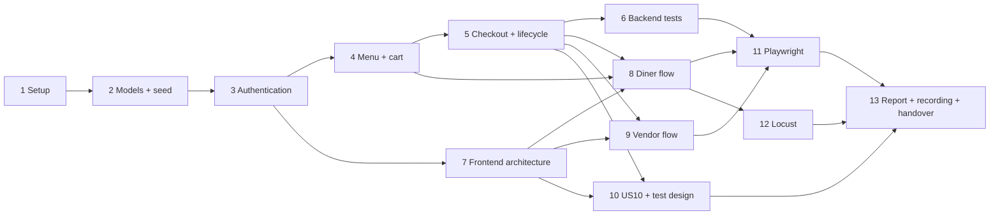

# SkipQ ICT381 TMA Implementation Plan

> **For agentic workers:** REQUIRED SUB-SKILL: Use superpowers:subagent-driven-development or superpowers:executing-plans to implement this plan task-by-task. Steps use checkbox syntax for tracking. **The user selected lab adaptation; Task 1 foundation is verified and committed locally. The remaining business design and implementation tasks are proposed for review.**

**Goal:** Build and evidence an individual SkipQ application covering every assessed requirement in the 100-mark ICT381 TMA.

**Architecture:** Two separate repositories: a Flask REST backend with MongoEngine models and a React SPA consuming it. Model methods own database access, ownership, calculations, and lifecycle decisions. Seeded users exercise diner/vendor flows, and US10 adds current/past order viewing to the existing Order List and Order Detail screens.

**Tech Stack:** Installed Python 3.12.15; Flask, MongoEngine, flask-httpauth, itsdangerous, pytest, pytest-playwright, Locust; local MongoDB Community 8.0.32; React, react-router-dom, Node 22.17.0/npm 10.9.2. Lab Create React App retained with `react-scripts` 5.0.1, a pinned TypeScript 4.9.5 build peer and a regenerated lockfile; application source remains JavaScript. Runtime versions and compatibility changes are recorded in the setup guide and application READMEs.

**Spec:** [Proposed design and selected setup approach](../specs/2026-10-06-skipq-design.md). Read it together with the original TMA PDF and GBA. Checked steps describe verified progress; unchecked steps remain intended work.

## Global Constraints

- Deadline: **Monday 19 October 2026, 23:55, Singapore time**.
- Two **course-provided** GitHub repositories: backend and frontend. Do not create replacement remote repositories.
- Backend: Flask REST API, MongoDB, **MongoEngine** documents and model-owned data access.
- Frontend: React SPA with **react-router-dom** and JSON API calls.
- Tests: pytest unit and functional suites; Python Playwright browser lifecycle; Locust endpoint load test.
- Backend holds `db_seed/`, `tests/playwright/`, `tests/stress/locustfile.py`, `q6-performance/`, and `q7-screencast/`.
- Report roughly 3,000 words maximum, excluding tables, screenshots, listings, and appendices; Q7(b) uses 400–500 words for both hypotheses combined.
- Disclose every AI prompt used, question labels, and a short account of verification. Planning suggestions are not measured results.
- Local execution only. No real gateway, cloud/operations work, or frontend unit/component suite.
- Pure unit tests must work without MongoDB. Functional tests use real MongoDB with separate configuration.
- Use canonical `Pending`, `Preparing`, `Ready`, `Collected`, `Cancelled`, `NoShow` statuses, with payment separate.
- Application artifacts and report are individual work. Do not invent past commits, measurements, screenshots, provenance, or test results.

## Review Focus

1. Cart item/stall becomes unavailable after browsing: fresh checkout validation must return 409 and create no paid order (Tasks 4, 5, 9, 13).
2. Duplicate or retried checkout: one paid order only; identical replay 200, first create 201, conflicting key reuse 409 (Tasks 5, 6, 8).
3. Valid token with wrong role or owner/stall: 403 and no state change or leaked data (Tasks 3, 4, 5, 6, 10).
4. Past menu edits/removal: stored order name/price/total remain unchanged and readable (Tasks 2, 5, 10).
5. No-show boundary and terminal states: Ready + 29m59s refuses; Ready + 30m allows; final states refuse further changes (Tasks 5, 6, 9).

---

## Start here

Completed preparation: both repositories cloned into `backend/` and `frontend/`; remotes verified; TMA and GBA reviewed; proposed design and four-capability audit draft written. The user selected **adapt lab code**. Startup foundations, project dependencies, ignored local environment files, and local MongoDB are now configured. Backend configuration/JSON/CORS and MongoDB ping/version checks succeeded; the frontend production build succeeded. Models, seeded users, sign-in, persona flows, and assessed suites/evidence are still pending.

Selected sources: `StaycationX_Backend` at `153ce9004ceb6fde84c35873b53b4957c76062a3`, and `StaycationX_Frontend` at `bc3367629ff31b920634dc3c046684f8c3877059`, both public repositories owned by the user. Keep source/compatibility notes in `backend/docs/report/provenance.md`. Current work uses `setup/lab-adaptation` in each repository. No worktree was created because the clones had no initial commit and no existing application changes to isolate.

Next business decisions for review: US10 as the extra story and the documented GBA corrections/lifecycle. The next planned implementation increment is Task 2, typed models and repeatable seed data. Recommended execution is inline implementation with small tested commits; independent reviews can check completed milestones.

The existing supplied repositories are:

- Backend: `https://github.com/ArellaKoo/devops-assignment-BE.git`
- Frontend: `https://github.com/ArellaKoo/devops-assignment-FE.git`

The PDF says the course provides the repositories. Confirm these are the intended submission repositories before handover; cloning them does not establish that provenance.

## Marks and evidence map

| Question | Marks | What must work or be argued | Planned evidence / task |
|---|---:|---|---|
| Q1(a) | 12 | Four capabilities; each Status + five-artifact audit; extra-story reason; update gaps throughout build | `docs/report/q1-audit.md`; all tasks, final Task 13 |
| Q1(b) | 2 | Actual lab reuse, explanation per copied/rewritten module | `docs/report/provenance.md`; Task 1 |
| Q2(a) | 4 | Typed MongoEngine entities and references/embedded relationships | `app/models/`; Task 2 |
| Q2(b) | 4 | Models own data access; configurable DB host/name | model methods and `.env.example`; Tasks 1–5 |
| Q2(c) | 4 | Seed script, README credentials, criterion-by-criterion coverage argument | `db_seed/`, seed coverage table; Task 2 |
| Q3(a) | 4 | Persona Blueprints, frontend-used JSON routes, meaningful status codes | `app/controllers/`; Tasks 3–5 |
| Q3(b) | 5 | Token, role, scope checks; 2–3 sentences explaining grouping | `app/auth.py`, model scope checks, actual tests; Tasks 3, 6 |
| Q3(c) | 5 | Model-guarded lifecycle; 1–2 sentences explaining placement | `Order.transition_to`, guard tests; Tasks 5, 6 |
| Q3(d) | 4 | GBA/audited rules, actionable refusal messages | validation + API refusals; Tasks 2–6 |
| Q4(a) | 6 | Both allow/refuse unit cases, no Mongo server, GIVEN/WHEN/THEN docstrings; explain what mocks prove/cannot prove | `tests/unit/` + named-method comparison; Tasks 2–6 |
| Q4(b) | 6 | Full order API lifecycle, separate real tokens, code + state every step, safe fixtures, same-DB repeatability; two concrete strengths | `tests/functional/`, `tests/conftest.py`, two runs; Task 6 |
| Q4(c) | 9 | Extra-story test design table; coverage strategy and justified implementation order; no implementation requested | `docs/report/q4-extra-story-tests.md`; Task 10 |
| Q5(a) | 9 | Route table/reasoning; four required + one own cross-cutting decision; module, alternative, limitation | frontend modules + architecture table; Task 7 |
| Q5(b) | 11 | All four capabilities; visible state; lawful controls; duplicate-submit prevention; screenshots; extra-story reused screens | React flows + actual screenshots; Tasks 8–10 |
| Q6(a) | 5 | Browser happy lifecycle, UI login for both roles, visible state every step, no sleeps, same-DB repeatability; concrete distinction from Q4 | `tests/playwright/`, README command, two runs; Task 11 |
| Q6(b) | 4 | Frequent endpoint rationale, sustained local load, recorded figures, ≤100-word evidenced DB verdict | `tests/stress/locustfile.py`, `q6-performance/`; Task 12 |
| Q7(a) | 3 | Narrated ≤8min 720p MP4, same order both roles, sold-out + another rule refusal, honest failures, accessible links | `q7-screencast/`, both READMEs/report; Task 13 |
| Q7(b) | 3 | Two falsifiable hypotheses, diner/vendor, four required labels, basis for rough counts, 400–500 words combined | report closing section; Task 13 |
| **Total** | **100** | Working application plus specific, honest evidence | Coverage is a planning target, not a promised grade |

## Schedule and dependencies

Assumption: roughly 3–5 focused hours per day, about 45–55 hours overall including learning and revisions. Keep 19 October as contingency; aim to finish on 18 October. If time tightens, preserve assessed flows/tests/report and reduce styling.

| Date | Deliverable | Tasks | Exit condition |
|---|---|---|---|
| 6 Oct | Review plan, lab decision, repository/runtime setup | 1 | Both clean app skeletons install from their READMEs |
| 7 Oct | Typed models and useful seed data | 2 | Pure validation tests pass; seed coverage argument maps criteria |
| 8 Oct | Login, role/scope boundaries | 3 | Seeded users obtain tokens; wrong roles/owners refused |
| 9 Oct | Stall/menu/cart rules | 4 | Open/close, sold-out, quantities, totals are correct |
| 10 Oct | Paid order creation and model lifecycle | 5 | Happy path plus reject/refund/no-show work |
| 11 Oct | Unit and functional suite | 6 | Unit suite offline; functional suite passes twice |
| 12 Oct | Shared frontend architecture | 7 | Login and protected navigation call running API |
| 13 Oct | Diner flow | 8 | Browser orders and tracks; cannot double submit |
| 14 Oct | Vendor flow and US10 | 9, 10 | Same order reaches collection; own current/past orders visible |
| 15 Oct | Playwright full-system evidence | 11 | Same lifecycle passes twice with UI assertions |
| 16 Oct | Locust and evidence analysis | 12 | CSV/HTML and supported ≤100-word verdict saved |
| 17 Oct | Report, screenshots, screencast, PMF | 13 | All question sections and real evidence assembled |
| 18 Oct | Fresh-checkout rehearsal and corrections | 13 | Both READMEs sufficient; links, credentials, run commands checked |
| 19 Oct | Submission buffer | 13 | Cover URLs, disclosures and accessible artifacts checked before 23:55 |



These are work dependencies for your individual submission, not a group assignment of the code. Write Q1/Q2/Q3/Q5 report notes and prompt disclosures alongside each task rather than waiting for Task 13.

## Planned file structure

Paths below are relative to `backend/` or `frontend/`. Preserve lab naming where appropriate, but delete hotel-domain and OneMap code. No empty demonstration endpoint that the frontend never calls is needed.

```text
backend/
  README.md, .gitignore, .env.example, requirements.txt, requirements-dev.txt, pytest.ini
  app/__init__.py, config.py, extensions.py, auth.py, errors.py
  app/models/user.py, vendor.py, menu_item.py, cart.py, payment.py, order.py
  app/controllers/auth.py, diner.py, vendor.py
  db_seed/__init__.py, seed.py, fixtures.json
  tests/conftest.py
  tests/unit/test_validation.py, test_cart.py, test_order_guard.py, test_auth_rules.py
  tests/unit/conftest.py, test_foundation.py  # implemented startup regressions
  tests/functional/test_order_lifecycle.py, test_access_and_checkout.py
  tests/playwright/test_order_lifecycle.py
  tests/stress/locustfile.py
  docs/report/q1-audit.md, provenance.md, seed-coverage.md, frontend-architecture.md
  docs/report/q4-extra-story-tests.md, report-outline.md
  docs/assessment/ai-prompts.md, delegated-prompts.md, setup-guide.md, foundation-verification.md
  docs/evidence/screenshots/
  q6-performance/                 # actual measured CSV/HTML + run metadata
  q7-screencast/                  # actual narrated MP4 or accessible-hosting note
frontend/
  README.md, .gitignore, .env.example, package.json, package-lock.json, .nvmrc
  src/index.js, index.css, App.js, config.js, api/client.js
  src/auth/AuthContext.jsx, RequireRole.jsx
  src/context/FeedbackContext.jsx
  src/components/FeedbackBanner.jsx, AsyncButton.jsx
  src/layouts/DinerLayout.jsx, VendorLayout.jsx
  src/pages/LoginPage.jsx
  src/pages/diner/StallListPage.jsx, MenuPage.jsx, CartPage.jsx, CheckoutPage.jsx
  src/pages/diner/OrderListPage.jsx, OrderDetailPage.jsx
  src/pages/vendor/MenuPage.jsx, MenuItemFormPage.jsx, OrderListPage.jsx, OrderDetailPage.jsx
  public/images/                 # own/bundled seed image assets
```

### Task 1: Reproducible foundation and provenance

**Files:** backend manifests/config/factory/errors, `.env.example`, `.gitignore`, README; frontend manifest/config/README; backend report provenance, audit and prompt log.

**Interfaces:** consumes two cloned repositories and the selected lab manifests; produces `create_app(config: dict | None = None) -> Flask`, configurable MongoEngine connection, example environment files, frontend development command. No application secrets in examples. MongoEngine uses one active database configuration per process; fixtures explicitly disconnect at teardown before switching configurations, and never retarget a live app.

- [x] Inspect selected lab sources; record source URL/commit and copied/adapted module purpose. Import only code understood and required by SkipQ; omit source secrets, hotel/OneMap features, seed databases, and Selenium scripts.
- [x] Create the four-capability Q1 audit draft before implementation, using the audit worksheet linked below.
- [x] Install compatible project runtimes and local MongoDB. Python 3.12.15 is separate; existing nvm Node 22.17.0 is selected only in the project shell. Homebrew MongoDB was blocked by old Command Line Tools; a SHA-256-verified official 8.0.32 archive is extracted under workspace `.local/tools/`.
- [x] Add isolated backend environment/manifests, application factory, JSON error mapping, DB host/name settings, and CORS restricted to the local frontend origin. Local secret is generated only in ignored `.env`.
- [x] Add frontend Create React App configuration and target lockfile; upgrade `react-scripts` to 5.0.1 after reproducing the source lockfile and Webpack/OpenSSL failures. Record Node 22.17.0/npm 10.9.2 in setup documentation.
- [x] Document both repository links, prerequisites, install/config/run commands and pending seed/token/assessed-test work in the starter READMEs and setup guide. Do not present future commands as passing evidence.
- [x] Verify Python imports/app creation, fresh dependency installation, frontend clean installation/build and browser startup. Check ignored `.env`, `.venv`, cache, database data, node_modules and normal build output; do not ignore required q6/q7 artifacts.
- [x] Commit actual foundation work separately in each repository. Backend foundation: `67cd54e`; frontend foundation: `a10607d`. Both are local on `setup/lab-adaptation`; nothing is pushed or submitted.

Verified: backend app creation and live JSON 404/CORS checks; real MongoDB ping and 8.0.32 version; fresh Python dependency installation and clean `pip check`; four foundation regression cases for HTTP headers and sequential app configuration with no network access; frontend clean `npm ci`, valid dependency tree, production build and development startup; headless Chrome rendering/deep-link refresh/navigation/direct API access; ignore rules and local secret permissions. Independent review findings were reproduced and resolved through explicit fixture teardown and response-header preservation. See `docs/assessment/foundation-verification.md`. These are startup checks, not Q4/Q6 domain or lifecycle results.

### Task 2: Domain documents and seed coverage

**Files:** all six backend model files, `db_seed/`, `tests/unit/test_validation.py`, `test_cart.py`, report seed coverage.

**Interfaces:** `User.find_by_email(email: str) -> User | None`; `Vendor.list_open() -> list[Vendor]`; `MenuItem.list_for_vendor(vendor: Vendor) -> list[MenuItem]`; `Cart.for_diner(diner: User) -> Cart`; `Cart.total_cents(items: list[MenuItem]) -> int`; `Order.list_for_diner(diner: User, view: str = 'all') -> list[Order]`. Models from the design use references/embedded documents and integer cents.

- [ ] Write rule tests with GIVEN/WHEN/THEN docstrings: price `0`, `9999.00`, and `1.001` refuse; `0.01` and `9998.99` allow; names 0/81 characters refuse and 1/80 allow; description 501 refuses; quantity negative/fraction/boolean refuses; two lines at 350×2 and 275×1 total 975 cents.
- [ ] Run `python -m pytest tests/unit/test_validation.py tests/unit/test_cart.py -q`; verify meaningful failures because the rules are absent, not solely import/package misconfiguration.
- [ ] Implement typed documents, validation, model-owned lookup/create/update methods, cart references, embedded payment/order snapshots, and required uniqueness. No query logic in route files.
- [ ] Run the same unit tests with persistence mocked and no Mongo connection; verify all assertions pass.
- [ ] Implement idempotent seed upserts using deterministic fixture IDs/natural unique email keys. Seed D1/D2 plus empty-history D0, V1/V1B for S1 and V2 for S2, open/closed stalls, available/sold-out items, and own/other-diner orders across current/terminal states exactly as the testing worksheet specifies. Use local demo password `SkipQDemo2026!` and list the actual fixture emails in README.
- [ ] Run `python -m db_seed.seed` twice against `skipq_dev`; show stable record counts and valid credentials. Do not erase user data to seed. No production credentials.
- [ ] Complete the acceptance-criterion seed coverage table: record keys, why they establish each precondition, and manual steps where seeding cannot show transient invalid input or race behavior. Update Q1 with diagram/data gaps discovered.
- [ ] Commit `feat: add SkipQ documents and repeatable seed data`.

### Task 3: Token authentication and role/scope checks

**Files:** backend `app/auth.py`, `app/controllers/auth.py`, `User` methods, `tests/unit/test_auth_rules.py`; actual API security cases in Task 6.

**Interfaces:** `User.authenticate(email: str, password: str, now: datetime) -> User`; token verifier obtains a trusted `User`; `require_role(role: str)` gates persona Blueprint operations. Endpoint `POST /api/user/gettoken` returns token and trusted persona identity to the UI.

- [ ] Write unit cases executing actual password/role/lock logic with record access supplied: valid/invalid password, unknown role, 5 failures, before/at 15-minute unlock. Do not mock `authenticate` while claiming to test it.
- [ ] Run `python -m pytest tests/unit/test_auth_rules.py -q`; confirm the missing behavior fails.
- [ ] Implement 3,600-second signed Bearer tokens using flask-httpauth or lab-equivalent, normalized unique emails, password hashing, role checks, and actor-required model access. Token key comes from config; attempts 1–4 return 401 and failed attempt 5 locks for 15 minutes/returns 429, with reset at expiry or successful login.
- [ ] Verify seed login returns 200 JSON; bad credentials 401; locked account 429; protected request without/with invalid/expired token 401; wrong persona 403. Exercise scope with another stall/diner through actual model methods/API in Task 6.
- [ ] Record Q3(b)'s 2–3 sentences distinguishing shared Blueprint role enforcement from record ownership in models. Update Q1 with missing token/lockout/ownership criteria.
- [ ] Commit `feat: authenticate seeded diners and vendors`.

### Task 4: Menu, trading state, and cart

**Files:** backend diner/vendor controllers, Vendor/MenuItem/Cart methods, unit cart/rule tests; report audit.

**Interfaces:** `Vendor.set_open(actor: User, is_open: bool) -> Vendor`; `MenuItem.create_for_vendor(actor: User, values: dict) -> MenuItem`; `MenuItem.update_for_vendor(actor: User, item_id: str, values: dict) -> MenuItem`; `Cart.set_item(diner: User, item: MenuItem, quantity: int) -> Cart`; `Cart.remove_item(diner: User, item_id: str) -> Cart`. Routes match the design table.

- [ ] Write and run failing unit cases for available item addition, zero removal, valid quantity changes, single-stall conflict, wrong owner, and server-calculated totals. Supply current menu/stall records without accessing MongoDB.
- [ ] Implement own-stall menu list/create/edit/soft-delete, availability toggles and open/close model operations. Return name/price/image/detail plus availability/open-state data for pre-action display.
- [ ] Implement persisted diner cart operations and actionable 400/403/409 errors using the design's stable error codes and fingerprint algorithm; actor identity comes from verified token, never a trusted request `diner_id`.
- [ ] Run cart/validation unit tests; manually call the API as both personas, including malformed IDs and wrong-stall edits. Confirm every outcome is JSON with the specified status.
- [ ] Close a stall with existing paid seeded orders and verify they remain accessible for processing; record US12's omission from GBA Q4/Q7 in the audit.
- [ ] Commit `feat: manage menus trading state and diner carts`.

### Task 5: Checkout and guarded order lifecycle

**Files:** backend Order/Payment methods, persona order routes, `tests/unit/test_order_guard.py`, targeted rule tests.

**Interfaces:** `Order.place_from_cart(diner: User, cart: Cart, payment_method: str, simulate_success: bool, checkout_key: str, expected_fingerprint: str, now: datetime) -> tuple[Order, bool]` where bool indicates newly created; `Order.transition_to(actor: User, target: str, now: datetime) -> Order`; `Order.get_for_diner(diner: User, order_id: str) -> Order`; `Order.get_for_vendor(actor: User, order_id: str) -> Order`; `Order.allowed_actions(actor: User, now: datetime) -> list[str]`.

- [ ] Parameterize every pair of the six states: allow only four normal/exception transitions plus guarded Ready→NoShow; refuse all other pairs, including repeat transitions and terminal-state changes. Add explicit 29m59s/30m boundary tests. Assert refusal leaves state unchanged.
- [ ] Run `python -m pytest tests/unit/test_order_guard.py -q`; verify guard tests fail before the implementation.
- [ ] Implement the guard in `Order.transition_to`, using an injected clock and an atomic expected-current-state update for persistence. Routes invoke it without owning transition rules. Rejection embeds a simulated refund; record Ready time on entry. `Order.allowed_actions` reuses the guard decision rules and vendor serialization returns its result.
- [ ] Implement checkout inside model-owned operations: fresh open/stock/price checks, supported simulated payment method, integer total, snapshots, embedded receipt, queue number, unique actor/request-key constraint, then cart clearing. Generate queue number as `Q-` plus full UUID hex, backed by uniqueness; no promise of sequential numbers.
- [ ] Return 201/Pending on first success, 200/same order on matching replay, 409 on conflicting reuse/payment failure/stale price/closed/sold-out conflict. Failed simulated payment creates no order or queue number and keeps the cart. In a collision from concurrent matching requests, retrieve and return the winner rather than leaking a DB exception.
- [ ] Run unit guard/rule tests and manually execute Pending→Preparing→Ready→Collected with separate tokens. Test reject/refund, early no-show and terminal refusal. Real persistence/retry evidence is completed in Task 6.
- [ ] Record Q3(c)'s explanation using `Order.transition_to`, and update Q1's inconsistent state diagram/payment workflow entries.
- [ ] Commit `feat: place paid orders and guard fulfillment transitions`.

### Task 6: Backend test proof and repeatability

**Files:** `tests/conftest.py`, functional lifecycle/access/checkout files, unit suite, `pytest.ini`; Q4 explanation notes.

**Interfaces:** pytest `app`, `client`, `seeded_records`, `test_db` fixtures create/configure an app against `skipq_test`; unit fixtures supply records without connecting to MongoDB. Functional users obtain actual tokens through `/api/user/gettoken`.

- [ ] Add a fixture safety guard that rejects the development database name before cleanup. Setup/teardown removes only this suite's dedicated fixture records and orders; never silently fall back to `skipq_dev` or report skipped tests as proof. Explicitly disconnect MongoEngine during final fixture teardown before another database configuration is used in that process; do not switch the connection under a live app.
- [ ] Write `test_diner_and_vendor_complete_order`: diner login 200; order create 201/Pending; vendor login 200; accept 200/Preparing; ready 200/Ready; collect 200/Collected. Assert HTTP code and body state immediately after each step, plus diner-visible status after vendor changes.
- [ ] Add compact real-DB cases for other-diner/other-stall 403, missing token 401, wrong role 403, stale sold-out/closed checkout 409 with no inserted order, changed-price review 409, and sequential plus concurrent matching checkout with exactly one persisted order. Use separate clients/thread-local database access for the concurrent pair; prove the unique constraint through actual results. Include historical snapshot persistence in a model-focused test without implementing Q4(c)'s history API suite.
- [ ] Verify `python -m pytest tests/unit -q` succeeds with MongoDB stopped or an unreachable DB URI plus a connection-attempt sentinel. Keep functional app fixtures function-scoped and lazy, with alias teardown between cases; they must not connect during unit collection or overlap a differently configured unit app in the same process.
- [ ] Start MongoDB and run `python -m pytest tests/functional -q` twice against the same configured `skipq_test`; both runs must pass and leave repeatable state.
- [ ] Write Q4(a)'s named-method distinction: mocked-persistence `Order.transition_to` still exercises its real guard; mocking the query result of `Order.list_for_diner` cannot prove the actual MongoDB owner filter/sort. Do not add an assertion on a mocked return value and call it query verification.
- [ ] Write Q4(b)'s two concrete strengths: actual token/route/model integration, and real database references/updates/fixture isolation, each citing steps/assertions absent from the unit suite.
- [ ] Commit `test: prove lifecycle authorization and checkout persistence`.

### Task 7: Shared frontend architecture

**Files:** frontend config/API/auth/feedback/button modules, persona layouts, App, LoginPage; backend frontend-architecture report table.

**Interfaces:** `api.request(path, options) -> Promise<JSON>` attaches current token, handles configured base URL, parses JSON refusals and 401 expiry; AuthContext exposes user/token/login/logout; RequireRole accepts permitted role; AsyncButton accepts busy state and click handler.

- [ ] Implement react-router-dom routes exactly as the design, with protected nested persona layouts and a reachable not-found view. No registration/user-admin/OneMap routes.
- [ ] Implement shared base URL and token handling; config example identifies API `http://127.0.0.1:5001`; local CORS permits frontend `http://127.0.0.1:5173`.
- [ ] Implement seeded UI login, persona redirect, per-tab token state and logout. Backend role/scope checks remain authoritative.
- [ ] Implement shared actionable feedback and AsyncButton pending behavior. Check that error text reaches the screen that caused the request and expired auth offers sign-in.
- [ ] Populate Q5(a)'s route and five-decision tables: module/component, why versus a real alternative, and what it does not provide. Fifth decision is shared request-in-flight control behavior; distinguish it from database idempotency.
- [ ] Run `npm run build`; manually verify diner/vendor login, protected navigation and 401/403 feedback against the running API. No frontend unit suite is required.
- [ ] Commit `feat: share frontend authentication requests and navigation`.

### Task 8: Diner baseline flow

**Files:** frontend diner StallList/Menu/Cart/Checkout/OrderDetail pages; actual screenshots and Q1/Q5 notes.

**Interfaces:** consumes the diner API contract and shared modules; produces a complete UI ordering flow and stable accessible labels used by Playwright.

- [ ] Implement open-stall discovery and menu/item detail; show sold-out state and disabled Add control before action, price/image/detail, and stall closure banner.
- [ ] Implement cart addition/removal/quantity/total, stale-stock toast, and a review step with server-derived checkout fingerprint.
- [ ] Implement simulated payment success/failure, retaining one checkout key for a retry; synchronous handler re-entry guard plus pending disabled control prevents double submission. Show payment result, queue number and returned order.
- [ ] Implement order tracking with current status and explicit Refresh; poll active views every 3 seconds, stop on unmount/terminal state, and show actionable errors.
- [ ] Manually complete diner login→menu→cart→checkout→tracking; attempt double-click, expired session, stale price and a vendor-sold-out cart. Capture each distinct screen/state for Q5(b), including loading/refusal/success where relevant.
- [ ] Run `npm run build`, update Q1 screen gaps and Q5 flow evidence, then commit `feat: let diners place and track orders`.

### Task 9: Vendor baseline flow

**Files:** frontend vendor menu/form/queue/detail pages, screenshot evidence, Q1/Q5 notes.

**Interfaces:** consumes vendor API; uses response `allowed_actions` for UI controls, while backend guard always decides validity.

- [ ] Implement own menu display/add/edit/remove/availability and open/close control. Preserve access to paid orders after closure.
- [ ] Implement paid order queue and detail, with item quantities, queue number and payment state. Offer only permitted Accept/Reject/Ready/Collected/NoShow controls; NoShow appears only after Ready+30 minutes.
- [ ] Walk the same diner-created order through preparation/collection in a second signed-in browser context; show cancellation/refund and no-show using seeded exceptional cases.
- [ ] Confirm other-stall data/actions are unavailable, forbidden controls never appear, and terminal orders are read-only. Capture every vendor flow screen for the report.
- [ ] Run `npm run build`, record screen/rule gaps in Q1, then commit `feat: let vendors manage trading and fulfillment`.

### Task 10: US10 implementation and design-only test cases

**Files:** backend `Order.list_for_diner` and diner list/detail routes; frontend OrderListPage/OrderDetailPage; report extra-story table.

**Interfaces:** `GET /api/diner/orders?view=all|current|history` defaults All; own orders newest-first with ID tie-breaker; empty list 200/`items: []`; invalid view 400. Historical detail uses snapshotted name/unit price/quantity/total.

- [ ] Audit US10's thin criterion before coding: add explicit ownership, empty history, sorting, terminal categories, read-only detail, refresh and historical snapshot outcomes, explaining why each is needed.
- [ ] Implement own-diner current/past listing and All/Current/Past filters on the existing Order List; reuse the tracking/detail screen for read-only past detail. Do not add an unnecessary history page.
- [ ] Verify via browser with seeded mixed-status/other-diner orders, empty history, newest-first order and a changed menu price. Capture screens and write Q5(b)'s explanation naming the two reused screens.
- [ ] **Design, without implementing**, Q4(c)'s functional cases using the supplied test/evidence worksheet: exact five columns, persona and ordered endpoints, expected statuses/body, limitations for UI scrolling/display. Include Strategy and Priority paragraphs grounded in the augmented criteria.
- [ ] Run frontend build and existing suites if implementation affected them; do not create the proposed extra-story functional test suite for Q4(c). Commit `feat: show diners their current and past orders` and the designed cases.

### Task 11: Playwright system lifecycle

**Files:** backend `tests/playwright/test_order_lifecycle.py`, fixture support in `tests/conftest.py`, README run command, Q6(a) explanation.

**Interfaces:** dedicated `skipq_system_test` API at :5001 and React at :5173, seeded accounts; two isolated browser contexts logged in through UI. Test creates its own order, captures queue number/ID, and targets that record in vendor queue.

- [ ] Write UI-driven diner login→add→checkout→Pending, vendor login→Preparing→Ready→Collected. Assert diner/vendor-visible state at every stage, not just final collection.
- [ ] Use accessible role/label locators and Playwright `expect` waits; no `sleep`, timeout-only assertions, browser token injection or mocked API in the lifecycle.
- [ ] Isolate new order data and clean it via fixture/model infrastructure outside the persona interaction steps. Preserve existing seed data; use fresh contexts and unique order key on each run.
- [ ] Install Chromium using `python -m playwright install chromium`; document prerequisites and server-start/test commands in backend README.
- [ ] Run `python -m pytest tests/playwright -q` twice against the same seeded system-test database; retain truthful evidence and investigate any failure rather than replacing waits with fixed sleeps.
- [ ] Write 3–4 sentences citing actual UI steps that demonstrate rendering, navigation, request/token attachment and cross-persona screen updates that the in-process functional test cannot establish. Commit `test: exercise order lifecycle through both browser personas`.

### Task 12: Locust measurement and bounded conclusion

**Files:** backend `tests/stress/locustfile.py`, optional opt-in timing instrumentation in the owning model/application, `q6-performance/`, Q6(b) notes.

**Interfaces:** menu polling endpoint `GET /api/diner/stalls/<id>/menu`, authenticated diner; model `MenuItem.list_for_vendor`. Measure actual local runtime, not production performance.

- [ ] Justify endpoint choice from concrete menu-browsing and 3-second polling behavior in Q5, compared with less frequent order creation.
- [ ] Implement Locust login once per simulated user and menu requests with explicit success/content checks. Report login separately from the menu endpoint statistics.
- [ ] Instrument opt-in duration around materialized `MenuItem.list_for_vendor` results and full request; record query count, returned row count, serialization/server/CPU observations and measurement limits without placing query logic in routes. Timing a lazy QuerySet before iteration is not query execution evidence.
- [ ] Run a 5-user, 1-user/sec, 60-second sanity load. If stable, run the planned 10-user, 2-user/sec, 120-second measurement; choose a smaller actual load if needed.
- [ ] Example main run: `python -m locust -f tests/stress/locustfile.py --host http://127.0.0.1:5001 --headless -u 10 -r 2 -t 120s --csv q6-performance/menu --csv-full-history --html q6-performance/menu.html`. Save actual CLI/metadata alongside generated CSV/HTML.
- [ ] Report actual users, spawn rate, duration, machine specs, Flask server mode, dataset size, throughput, request/failure counts, p50/p95/p99 and query/request timing evidence. Distinguish authentication/setup from measured menu load.
- [ ] Write **no more than 100 words** on whether the database is the bottleneck, naming MenuItem and `list_for_vendor`, what each observation ruled in/out and uncertainty. No optimization proposal is required or rewarded. Commit `test: record local menu load and query timing evidence`.

### Task 13: Report, screencast, and clean-checkout handover

**Files:** backend report documents, evidence screenshots, `q7-screencast/`, both READMEs; final Canvas report created from actual evidence.

**Interfaces:** consumes all completed code/tests/measurements and GBA audit updates; produces coherent report, accessible recording and independently runnable repositories.

- [ ] Reconcile all four Q1 tables to final code: actual model/status/API/screen names, every correction discovered, and extra-story justification. Do not paste the GBA instead of citing it.
- [ ] Assemble the report using the word-budget outline; verify all question/subpart deliverables appear in Canvas and/or GitHub exactly where required. Cite final committed files/lines and actual test names/results.
- [ ] Record a narrated **≤8-minute, 720p MP4**: diner signs in/places an order; vendor signs in/moves **that same order** to collection; narrate expected outcome before both rule violations. For sold-out: add while available, vendor marks sold out, diner checkout visibly refuses. Second violation: close the stall after cart creation and attempt checkout, visibly refused.
- [ ] Preserve genuine errors/retries. If cutting startup/seed wait, explain the cut on screen. Keep MP4 under GitHub's 100MB file limit; otherwise use accessible hosting and verify from an account without owner privileges. Link from both READMEs and report.
- [ ] Write Q7(b)'s **400–500 words combined**, one diner and one vendor hypothesis, each under Pain / Hypothesis / Market and who pays / Test. Ground both in a specific built screen/state; label rough counts/assumptions, identify payer, cheapest validation and falsification threshold. Do not claim survey/market research that was not performed.
- [ ] Finish exact prompt disclosures for all AI use, per-question labels and verification summaries. Include prompts from planning and delegated design assistance; no invented disclosure entries or copied code presented as self-written.
- [ ] Commit final app/report evidence. Make temporary fresh clones of both actual repositories and follow only each README; install, seed, login/call protected endpoint, build/run frontend, unit suite without DB, functional/browser suites twice, and evidence/link access. Fix concrete failures and document actual results.
- [ ] Check GitHub contains final commits/required evidence; cover page has ICT381, assignment title, PI number, name, submission date and both URLs. Verify repository access for the marker and video playback, then submit before the deadline.

## Companion documents

- [Design and API contracts](../specs/2026-10-06-skipq-design.md)
- [Setup guide and verified environment status](../../assessment/setup-guide.md)
- [Four-capability GBA audit and report outline](../../assessment/report-workbook.md)
- [Testing and evidence worksheet](../../assessment/testing-and-evidence.md)
- [AI disclosure starter](../../assessment/ai-prompts.md)

## Final acceptance checklist

- [ ] All four capabilities work through the UI; extra US10 is demonstrable beyond baseline tracking.
- [ ] Every domain query/guard lives in a model; relationships are typed references/embedded records.
- [ ] Role **and** scope refusal are tested through the actual API with valid separate tokens.
- [ ] Unit suite succeeds with no Mongo server; functional/browser lifecycle each succeeds twice.
- [ ] Q4(c) test cases are designed, their coverage/priorities argued, and not falsely described as executed.
- [ ] State/sold-out/closed/payment feedback is visible; controls match persona/state; checkout duplicates cannot create a second order.
- [ ] Real Locust artifacts support the reported figures and bounded DB verdict.
- [ ] Q7 recording is honest, accessible, ≤8 minutes, and shows both prescribed violations.
- [ ] Four final Q1 audits, provenance, seed reasoning, architectural tradeoffs, test reasoning and AI disclosures are specific to this implementation.
- [ ] Both clean checkouts run from README alone; required artifacts/links are accessible.

Completion requires checking these against real output. This document supplies the work and proof strategy; it is not evidence that any application tests already pass.
