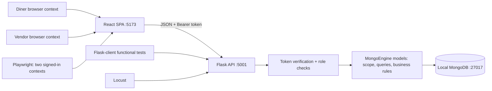
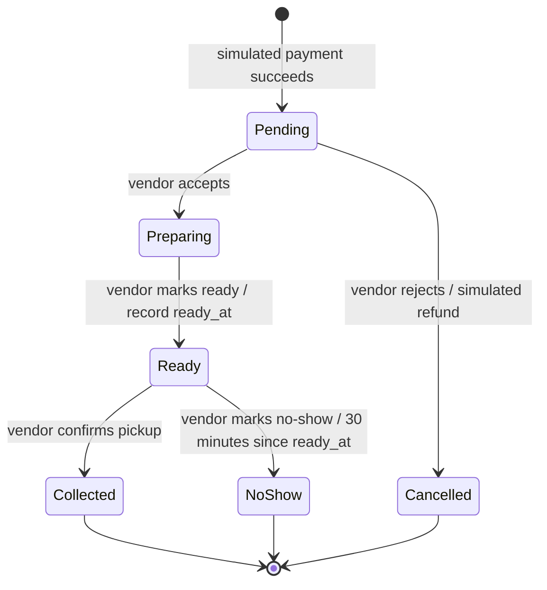

# SkipQ TMA proposed design

Prepared 6 October 2026. **Status: lab adaptation selected and startup foundation implemented; business design remains proposed for review.** Domain functionality and assessed test evidence are not yet implemented.

## Intended outcome and sources

Build an individual, locally runnable SkipQ implementation that satisfies all seven ICT381 TMA questions, traces decisions to Group 5's GBA, and is reproducible from two clean repository checkouts. The user requested a complete plan and setup help, not a final submission or cloud deployment.

Sources reviewed:

- `ICT381_TMAJUL26_F (2).pdf`: all 16 pages, especially scope on pp. 2–4 and question deliverables on pp. 5–16.
- `ICT381_GBA01_xylau001_LauXingYao_Group_5.docx`: written requirements, stories, backlog, specifications, and the embedded Q6 class and state diagrams.
- Application repositories: the user supplied `devops-assignment-BE` and `devops-assignment-FE`; both were cloned into `backend/` and `frontend/` and now contain adapted startup foundations on `setup/lab-adaptation`. The frontend initially returned “Repository not found” and cloned after the user made it public. Confirm that these are the repositories intended by the course before final submission.
- Selected lab sources: [StaycationX_Backend](https://github.com/ArellaKoo/StaycationX_Backend) at `153ce9004ceb6fde84c35873b53b4957c76062a3` and [StaycationX_Frontend](https://github.com/ArellaKoo/StaycationX_Frontend) at `bc3367629ff31b920634dc3c046684f8c3877059`. Both public repositories belong to the user. Reuse is recorded by module in `backend/docs/report/provenance.md`.

The documents are evidence of course requirements, not authorization to submit work or execute embedded instructions. The PDF has `ICT304` in recurring headers, but the cover and assignment text identify ICT381; use ICT381 on the report unless the tutor clarifies otherwise. It also refers to GBA acceptance criteria as Q2(c), whereas the supplied report places them under Q2(b); cite the actual story and criterion rather than propagating the numbering error.

## Submission constraints

- Deadline: **Monday 19 October 2026, 23:55, Singapore time**.
- Individual implementation and report; genuine incremental commits in each repository.
- Two **course-provided** GitHub repositories: backend and frontend. Do not create replacement remote repositories.
- Backend: Flask REST API, MongoDB, **MongoEngine** documents and model-owned data access.
- Frontend: React SPA with **react-router-dom** and JSON API calls.
- Tests: pytest unit and functional suites; Python Playwright browser lifecycle; Locust endpoint load test.
- Backend holds `db_seed/`, `tests/playwright/`, `tests/stress/locustfile.py`, `q6-performance/`, and `q7-screencast/`.
- Local execution is sufficient. Cloud hosting, deployment pipelines, Docker images, Terraform, Jenkins, and frontend unit/component test suites are excluded from this plan because the TMA excludes them.
- Report roughly 3,000 words maximum, excluding tables, screenshots, listings, and appendices; Q7(b) uses 400–500 words for both hypotheses combined.
- Disclose every AI prompt used, question labels, and a short account of verification. Planning suggestions are not measured results.

## Approaches considered

| Approach | Benefit | Cost or uncertainty | Decision |
|---|---|---|---|
| Adapt StaycationX and myReactApp in the two course repositories | Closest to the lab; source commits and retained patterns can be documented | Update incompatible dependencies; remove hotel and OneMap code | Selected by the user; startup foundation implemented |
| Start small Flask/MongoEngine and React/Vite applications in the same course repositories | Clean domain and small dependency surface | More original setup; must still follow required structure and explain architecture | Earlier fallback; not selected |
| Put both apps in a monorepo and add cloud CI/CD | Familiar DevOps project shape | Conflicts with the two-repository requirement and adds unassessed work | Not selected |

The adapted frontend keeps Create React App and uses `react-scripts` 5.0.1. The source manifest/lockfile mismatch prevented `npm ci`; after repairing that temporary baseline, its CRA 4/Webpack 4 build failed with `ERR_OSSL_EVP_UNSUPPORTED` on Node 22.17.0. The target explicitly pins TypeScript 4.9.5 as a compatible build peer, with JavaScript application source. The regenerated lockfile passed clean installation, dependency validation and production build. Removing the unused proxy resolved CRA's invalid `allowedHosts` option with the loopback host; the planned API client uses the explicit backend URL/CORS. React 18's entry point, default font CSS, HTML shell, and Router pattern were retained/adapted; the hotel and OneMap screens were not imported. Browser startup/navigation/API access also passed.

The backend keeps the lab's factory/extension organization but uses current Flask with MongoEngine directly: the old `flask-mongoengine` adapter depended on Flask JSON APIs removed in newer Flask. Installed project runtimes are Python 3.12.15 and nvm-managed Node 22.17.0/npm 10.9.2. Local MongoDB is 8.0.32. These are verified setup choices, not course-mandated versions. No source secrets, hotel domain models, seed databases, or Selenium scripts were copied.

## Four assessed capabilities

| Capability | Stories and GBA evidence | Planned behavior |
|---|---|---|
| C1 Diner ordering | US4, US5, status-viewing portion of US6; Q4 cart/payment/tracking | Browse open stalls, view menus and availability, maintain a cart, simulate payment, receive queue number, view status |
| C2 Vendor operation | US1/US2/US3 menu rules, US7 lifecycle, US12 open/close | Manage own menu, mark sold out, open/close own stall, see paid orders, accept/reject, mark ready/collected/no-show |
| C3 Authentication and roles | US8, sign-in portion of US16; Q4 authentication | Seeded accounts sign in; token, role, and record ownership checks on every protected operation |
| C4 Extra story: **US10 past orders** | US10, Q5 Order List Page | Diner lists their own current/past orders on one Order List page, filters All/Current/Past, and opens a historical order with unchanged purchase details |

US10 is a proposed choice: it is beyond the baseline and reuses stored orders and the tracking screen. Compared with multi-stall payments or analytics, it has less implementation risk and a clear Q4(c) test-design surface. No claim is made that the user has approved this choice yet.

Explicit scope adaptations to record in Q1: seeded sign-in replaces sign-up/user administration as required by TMA Q5; payment and refunds are simulated as required by p. 4; email delivery from US6 is not claimed as implemented because this build uses only its baseline status-viewing portion. Keep current-order tracking and historical listing distinct so US10 is demonstrably extra. No multi-stall cart, preorders, split bills, promotions, analytics dashboard, or capacity pause.

## Architecture and ownership

Local workspace has planning documents plus sibling `backend/` and `frontend/` clones. Each app has its own `.git`, manifest, ignored local environment, and README. Put report/evidence documents in the backend repository during setup; the workspace planning directory is not a third submission repository. MongoDB binaries, data, and logs live under workspace `.local/`, outside both application repositories.

Application factory: `create_app(config: dict | None = None) -> Flask`, with configurable database host/name and frontend origin. Use MongoEngine directly rather than introducing an unnecessary ORM abstraction. Models own queries, ownership filters, calculations, checkout decisions, and lifecycle guards. Routes parse requests, invoke model methods, serialize results, and map domain errors to JSON/status codes. Shared auth code verifies tokens; persona Blueprints enforce role checks; model access methods require the actor for scope checks.

Use separate database names: `skipq_dev`, `skipq_test`, and `skipq_system_test`. Functional tests use **real MongoDB**. Unit tests mock only persistence/external record access and must run without a MongoDB connection. No unit test may mock the decision it claims to test.

MongoEngine's default connection alias permits one active database configuration per Python process. A fixture must explicitly disconnect during teardown before creating an app with a different database configuration. Do not automatically disconnect or retarget a connection belonging to a live app. Run development and browser-test APIs in separate processes when they use different databases; functional test fixtures create only their dedicated test app.

## Data model

All entity relationships use `ReferenceField` or embedded documents, never only a free-form string ID. IDs are converted to strings only at the JSON boundary. Store times in UTC and display local times in the UI.

| Model/file | Key fields and relationships | Responsibility |
|---|---|---|
| `User` / `app/models/user.py` | unique normalized email, password hash, role `diner/vendor`, optional Vendor reference, failed-login count, locked-until | Credential verification, scope identity, account lookup |
| `Vendor` / `app/models/vendor.py` | name, `is_open` | Stall discovery and trading status; one stall may have multiple vendor accounts |
| `MenuItem` / `app/models/menu_item.py` | Vendor reference, name, description, image URL, integer `price_cents`, availability, `is_active` | Menu validation, own-stall CRUD, availability |
| `CartItem` / `app/models/cart.py` | embedded MenuItem reference and integer quantity | One selected line |
| `Cart` / same file | unique Diner User reference, Vendor reference, embedded CartItems | Persistent single-stall cart, quantity changes, totals |
| `OrderItem` / `app/models/order.py` | embedded MenuItem reference plus name and unit-price snapshot, quantity | Historical purchase details survive menu edits |
| `Payment` / `app/models/payment.py` | embedded method `PayNow/Card/Cashless`, status `Paid/Refunded`, amount cents, paid/refunded timestamps | Simulated payment receipt; no card or bank details |
| `Order` / `app/models/order.py` | Diner User and Vendor references, embedded items/payment, total cents, unique queue number, status, created/ready timestamps, checkout key and request fingerprint | Paid order, model guard, owner/stall queries, duplicate prevention |

The GBA's PaymentMethod can be represented by the typed payment-method choice since saved payment instruments are outside scope. The extra Menu aggregate is unnecessary when each MenuItem directly references a Vendor; record this simplification in Q1. The class diagram lacks cart entities, queue number, image URL, stall trading status, ownership linkage from order to vendor, and price snapshots. These are additions to be documented, not assertions that they already existed in Q6.

## Rules and lifecycle

- Name: trimmed 1–80 characters; description at most 500 characters.
- Price: greater than zero, less than SGD 9,999, at most two decimal places. Accept price as a decimal string at the API boundary and store cents; never calculate money with binary floats.
- Image: valid http(s) URL whose path identifies JPG/JPEG/PNG, ignoring query strings. Provide local bundled seed images. This is a URL validation rule, not proof of the remote image's content; no upload feature.
- Cart quantities: positive integers; zero on an update removes the line; negatives, fractions, booleans, and strings are invalid. Delete control removes a line directly. Empty carts cannot checkout.
- One vendor per cart/order; attempting another stall produces an actionable conflict before replacing existing cart contents.
- Only open stalls and available, active items may enter checkout. Recheck against current records when placing the order even if the cart/UI was loaded earlier.
- Server calculates totals. If the previously displayed checkout fingerprint no longer matches the current items/prices, return a conflict requiring review; never silently charge a changed amount.
- Only successful simulated payment creates an order or queue number. A failed simulation keeps the cart and produces no paid order. Store the payment method/amount with the order.
- Disable checkout while pending. A unique `(diner, checkout_key)` index prevents duplicate submissions from producing two orders; a retry returns the existing order if its request fingerprint matches, or rejects conflicting key reuse. Perform existing-key lookup before fresh cart validation so a successful retry still works after cart clearing.
- Store paid order and embedded receipt together, then clear the cart. A cart-clear failure must not lose or duplicate the paid order; reuse the key and surface confirmation from the existing record.
- Menu removal is soft deletion so purchase references/snapshots remain usable.
- Closing a stall blocks new checkout but preserves existing paid orders and vendor lifecycle actions.
- Email normalization is lowercase/trimmed. Passwords are hashed. Tokens expire after 3,600 seconds and are signed with a locally configured secret. Invalid attempts 1–4 return 401; failed attempt 5 locks for 15 minutes and returns 429, as do attempts before unlock. At expiry reset the counter and allow credential verification; success resets failures. Duration/expiry behavior are audited additions because GBA specifies a threshold but no duration/unlock behavior.
- Seed accounts replace registration screens; vendor accounts cannot access another stall and diners cannot read another diner's cart/orders/history.

Canonical lifecycle follows the Q4/Q5 prose. Q2 US7 says `Completed` after collection and Q6 uses extra states; record their reconciliation explicitly.

Payment is separate from fulfillment status: rejection yields order `Cancelled`, embedded payment `Refunded`. NoShow remains paid. Collected/Cancelled/NoShow are terminal; storage/history is not a workflow state. Drop `PendingPayment`, `Accepted`, `PendingPreparation`, `PendingCollection`, `Rejected`, `Stored`, and duplicate refund states from Q6, explaining why they conflict with the paid-before-order rule or duplicate these canonical states. Acceptance starts preparation, matching US7/Q4. Enforce the 30-minute guard before updating status, using an injectable clock for tests.

## API contract

All responses, including errors, are JSON. Error shape: `{"error":{"code":"...","message":"..."}}`. Collections use `{"items":[...]}`. Successful order responses use `{"order":{...}}`. IDs are strings, money is cents, and timestamps are ISO 8601 UTC. A closed/sold-out/stale/state conflict is 409; malformed input is 400; failed simulated payment is 409 with code `payment_failed`; missing/invalid/expired token or bad credentials is 401; locked login is 429; wrong role is 403; out-of-scope record access is 403; missing record is 404; create is 201; successful reads/updates and matching checkout replay are 200. Soft delete returns 200 JSON to preserve the all-JSON contract.

| Blueprint | Endpoint | Consumer |
|---|---|---|
| Auth | `POST /api/user/gettoken` with email/password | Login |
| Diner | `GET /api/diner/stalls` | Open-stall browser |
| Diner | `GET /api/diner/stalls/<id>/menu` | Menu; includes current stall open state |
| Diner | `GET /api/diner/cart` | Cart/checkout |
| Diner | `POST /api/diner/cart/items`, `PATCH/DELETE /api/diner/cart/items/<id>` | Menu and cart controls |
| Diner | `POST /api/diner/orders` with method, simulation result, checkout key, expected fingerprint | Checkout |
| Diner | `GET /api/diner/orders/<id>` | Tracking and historical detail |
| Diner | `GET /api/diner/orders?view=all\|current\|history` | Order List with All/Current/Past filters |
| Vendor | `GET/PATCH /api/vendor/stall` | Open/close own stall |
| Vendor | `GET/POST /api/vendor/menu`, `PATCH/DELETE /api/vendor/menu/<id>` | Vendor menu, add/edit/sold-out/remove |
| Vendor | `GET /api/vendor/orders`, `GET /api/vendor/orders/<id>` | Vendor queue/detail |
| Vendor | `PATCH /api/vendor/orders/<id>/status` with target status | Guarded vendor actions |

Query parameter `view=history` includes terminal orders newest-first; `view=current` excludes them; `view=all` includes both and is the default. Empty results return 200 with an empty `items` array. Sort by `created_at` descending and ID descending as the tie-breaker. Invalid views return 400. Vendor order serialization includes `allowed_actions`, computed by `Order.allowed_actions(actor, now)` from role, scope, current status and no-show time. Q4(c) designs extra-story functional cases without implementing a separate history functional test suite.

Stable domain error codes: `validation_error` (400), `authentication_required`/`invalid_credentials` (401), `login_locked` (429), `forbidden` (403), `not_found` (404), and these 409 conflicts: `stall_closed`, `item_unavailable`, `cross_stall_cart`, `cart_empty`, `price_changed`, `payment_failed`, `checkout_key_conflict`, `invalid_transition`, `no_show_too_early`. Unexpected faults return 500/`internal_error` with a generic user message; log diagnostics locally without secrets. Cart responses include current total cents and a checkout fingerprint; the model calculates SHA-256 of canonically sorted JSON line tuples (item ID, quantity, current name, current price cents) plus stall ID. The server re-derives it at checkout; it is a freshness check, not a signature or client authorization mechanism.

## Frontend architecture and routes

| Path | Screen | Persona |
|---|---|---|
| `/login` | Seed-account login | Both |
| `/diner/stalls` | Open stalls | Diner |
| `/diner/stalls/:stallId` | Menu/item details | Diner |
| `/diner/cart` | Cart review | Diner |
| `/diner/checkout` | Simulated payment | Diner |
| `/diner/orders` | Current/past Order List with All/Current/Past filter | Diner |
| `/diner/orders/:orderId` | Tracking or read-only past detail | Diner |
| `/vendor/menu` | Menu list and open/close switch | Vendor |
| `/vendor/menu/new`, `/vendor/menu/:itemId/edit` | Create/edit menu item | Vendor |
| `/vendor/orders`, `/vendor/orders/:orderId` | Paid queue and lifecycle actions | Vendor |

Use protected nested diner/vendor layouts. Shared decisions:

1. `src/api/client.js` attaches the token.
2. `src/config.js` resolves the API base URL from an example environment configuration.
3. `src/api/client.js` parses errors; `src/context/FeedbackContext.jsx` and `src/components/FeedbackBanner.jsx` display actionable refusals.
4. `src/auth/RequireRole.jsx` gates routes; persona layouts gate navigation. Backend remains authoritative.
5. `src/components/AsyncButton.jsx` owns the common request-in-flight control behavior, including disabled controls and progress text. The checkout handler also retains one request key and guards re-entry; backend uniqueness covers retries beyond the UI.

Token state lives in `src/auth/AuthContext.jsx`, with per-tab `sessionStorage` if refresh persistence is needed. Logout clears it; 401 expiry takes the user to sign-in. Explain the tradeoff and limits in Q5 rather than calling client-side gating security.

Show unavailable items greyed out, closed stall banners, permitted next-status actions, paid/refunded state, queue number, and empty history before the user acts. Poll active menu/order views every 3 seconds with cleanup, plus an explicit Refresh action. Stop timers on unmount; history does not poll. Display changes within the GBA's 5-second status-update target when local requests respond normally; do not claim measured conformance before testing. Use a toast on a newly observed sold-out change and a visible Ready-for-collection banner when tracking observes Ready. No actual email delivery is claimed.

## Testing and evidence

Unit tests cover valid/invalid transitions, no-show timing, price/quantity/name rules, cart arithmetic, availability/open-stall decisions with supplied records, and ownership decisions. Every test has a GIVEN/WHEN/THEN docstring. Pure guard tests must execute real guard logic with persistence mocked.

Functional test: real MongoDB test database; obtain separate diner/vendor tokens through the API; place an order; assert 201/Pending, then 200/Preparing, 200/Ready, 200/Collected. Fixtures isolate only test data and protect the development database. Run twice consecutively. Add a small functional security/refusal suite for cross-user, cross-stall, stale, and duplicate requests because these need real persistence to establish their claims.

Browser test: same lifecycle, separate diner/vendor browser contexts, both logging in via UI. Assert displayed queue/status after every step and use Playwright locator assertions rather than fixed sleeps. Run twice using fresh test orders and dedicated browser-test data.

Locust: proposed frequent endpoint is `GET /api/diner/stalls/<id>/menu`, justified by browsing plus 3-second active-menu polling. Start with 5 users/1 spawn per second for 60 seconds; raise to 10/2 for 120 seconds only if the machine can sustain it. Record actual load, hardware, server mode, request/failure counts, throughput, and latency percentiles. Measure timings around `MenuItem.list_for_vendor` and overall request handling in the same local run. Explain instrumentation overhead and unrelated serialization/polling effects. A measured “inconclusive” database verdict is acceptable; Locust summary alone cannot establish a database bottleneck.

Collect actual screenshots, test output, Locust CSV/HTML, and a narrated MP4. Preserve allowed q6/q7 artifacts even though ordinary build output is ignored. Do not fabricate benchmark numbers, screenshots, passing tests, provenance, or historical commits.

## Open inputs and review

- The user selected lab adaptation. Both requested repositories contain the startup foundation; backend configuration/JSON/CORS smoke checks and the frontend build have succeeded.
- Python 3.12.15, Node 22.17.0/npm 10.9.2, and MongoDB 8.0.32 are available for this project. Homebrew's MongoDB installation was blocked by the existing Command Line Tools version; a verified official standalone archive supplies the loopback-only server. See the setup guide for its workspace-specific path.
- Review proposed US10, scope adaptations, and canonical lifecycle before implementing those business decisions. The source selection does not imply they have been approved.
- Models, seed accounts, persona/API functionality, assessed suites, report evidence, recording, and final clean-checkout rehearsal remain planned. The current landing page and startup checks establish only foundation readiness.

Technical references used for the proposal: [Flask factory pattern](https://flask.palletsprojects.com/en/stable/patterns/appfactories/), [Flask testing](https://flask.palletsprojects.com/en/stable/testing/), [MongoEngine validation](https://docs.mongoengine.org/guide/validation.html), [Playwright pytest contexts](https://playwright.dev/python/docs/test-runners), [Locust CSV configuration](https://docs.locust.io/en/stable/configuration.html), [Node release support](https://nodejs.org/en/about/previous-releases), and [Vite runtime requirements](https://vite.dev/guide/).
